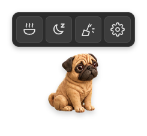
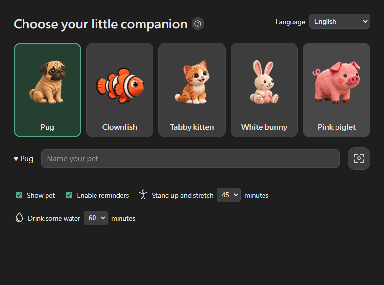

# DesktopPal

A cross-platform (Windows / macOS) virtual desktop pet. A transparent, click-through little companion roams your desktop, sleeps, and reacts to you — paired with sit-still and hydration reminders to look after you while it's at it.

*[繁體中文說明 →](README.zh-Hant.md)*

## Download

Grab the latest build from the **[Releases page](https://github.com/Bravakaikai/DesktopPal/releases/latest)** — pick the installer for your OS and run it:

- **Windows**: `DesktopPal Setup x.x.x.exe` (installer) or `DesktopPal x.x.x.exe` (portable, no install needed)
- **macOS**: `DesktopPal-x.x.x.dmg` — open it and drag DesktopPal into Applications

These builds aren't code-signed (that requires a paid developer certificate), so your OS will show a warning the first time:
- **Windows**: SmartScreen says "Windows protected your PC" — click **More info → Run anyway**.
- **macOS**: Gatekeeper refuses to open it normally — right-click (or Control-click) the app → **Open** → **Open** again in the confirmation dialog.

## Screenshots

| Pet overlay (toolbar open) | Pet picker & settings |
| --- | --- |
|  |  |

## Features

- **5 selectable pets**: Pug, Clownfish, Tabby cat, White bunny, Pink piglet (defined in `assets/pets/catalog.json`), each with a full set of idle/walk/run/eat/sleep/drag/react… spritesheet animations.
- **Hunger / mood stats**: decay over time; getting too hungry tanks mood faster and slows the pet down. Placing food lets the pet walk over and eat on its own; petting and rubbing raise mood.
- **Mess mechanic**: overfeeding causes an upset-stomach "vomit"; a well-fed pet eventually poops. Click a mess to clean it up (with a little broom animation).
- **Gestures**: hold and drag to move the pet, rub the mouse back and forth over it for a rub/tickle reaction, click it to pet it, hover to reveal the toolbar.
- **Toolbar**: Feed, Sleep / Wake (the button flips to "wake up" once the pet is asleep), Clean, and a settings gear that opens the picker window (which is where you switch pets).
- **Sit-still / hydration reminders**: default 45 / 60 minutes, aware of system idle time so it won't nag you while you're away from the keyboard. The reminder card docks next to the pet and can be dismissed or snoozed 5 minutes.
- **Picker / settings window** (opened from the tray or the toolbar's gear button): switch pets, bring the pet to the current screen, toggle the pet's visibility, tune reminder intervals, switch language.
- **Localization**: follows the OS language, or Traditional Chinese / Simplified Chinese / English — all strings and icon labels live in one place, `src/renderer/ui.js`.
- **Tray menu + right-click menu on the pet**: both share the same "Feed/Pet/Sleep/Clean/switch pet" menu-building logic (`actionMenuItems()` in `src/main/main.ts`).

## Tech stack

- **Electron + TypeScript**: a cross-platform desktop framework with a mature ecosystem for the things a desktop pet needs — transparent windows, always-on-top, click-through, and a system tray.
- **Renderer**: plain HTML/CSS + DOM; pet animation is done by swapping an `` through a spritesheet's frames (no canvas).
- **Main process**: owns the pet window (frameless, transparent, always-on-top, `setIgnoreMouseEvents` for click-through), the picker window, the tray, cross-window shared state, and IPC.
- **State**: a `PetStateManager` on the Node side tracks each pet's own hunger/mood/digestion timers independently and broadcasts updates to every window over IPC.

## Project structure

```
src/
  main/
    main.ts        # window management, tray, IPC, timers, menus
    petState.ts    # hunger/mood/digestion/mess state machine (per pet)
    reminders.ts   # sit-still/hydration reminder scheduling & snooze logic
    trayIcon.ts     # generates the tray icon (a placeholder dot for now)
  preload/
    preload.ts      # window.petAPI exposed via contextBridge
  renderer/
    index.html / renderer.ts / style.css   # the floating pet window
    picker.html / picker.js                # pet picker + settings window
    ui.js                                  # i18n strings and SVG icons shared by both windows
  shared/
    types.ts        # types shared between main and renderer
assets/
  pets/<id>/manifest.json + frame PNGs   # each pet's animation data, copied into dist/ at build time
  pets/catalog.json                      # the list of selectable pets (id/name/motion/speed)
scripts/
  copy-static.js           # build step: copies renderer static files + assets into dist/
  smoke-pets.cjs           # end-to-end smoke test driven by Electron's debugger protocol
  capture-screenshots.cjs  # dev tool: captures the README screenshots above
  generate-icon.cjs        # dev tool: composes build/icon.png (used by electron-builder) from the pug artwork
  blender-client.cjs       # manual dev helper that talks to a running Blender MCP socket
  build-2d-sprites.cjs     # one-off script that turns Blender pose atlases into transparent frame PNGs
```

## Development

```bash
npm install       # install dependencies
npm run build     # compile TypeScript and copy renderer static files + assets into dist/
npm run dev       # tsc -w, recompiles on change (run npm start in another terminal to see it live)
npm start         # build, then launch Electron
```

⚠️ **If your shell has `ELECTRON_RUN_AS_NODE=1` set** (common in some CI runners and sandboxed shells), `npm start` / `electron .` will run as plain Node instead of Electron — `require('electron')` returns a path string instead of the API, and the app crashes with `Cannot read properties of undefined (reading 'whenReady')`. Work around it with:

```bash
env -u ELECTRON_RUN_AS_NODE ./node_modules/electron/dist/electron.exe .
```

A normal terminal (PowerShell, a plain shell, your IDE's built-in terminal) usually doesn't have this variable set, so `npm start` just works there.

### Smoke test

```bash
npm run build
env -u ELECTRON_RUN_AS_NODE ./node_modules/electron/dist/electron.exe scripts/smoke-pets.cjs
```

Opens the pet window and drives it through switching between all 5 pets, feeding, petting, sleeping, dragging, placing food, cleaning up poop/vomit, the rub gesture, sit-still/hydration reminders, and language switching — any step that doesn't behave throws an assertion so you know exactly what broke.

## Building installers (cross-platform distribution)

Uses [electron-builder](https://www.electron.build/):

```bash
npm run dist        # package for whatever OS you're running on
npm run dist:win     # Windows: NSIS installer (DesktopPal Setup x.x.x.exe) + portable exe (DesktopPal x.x.x.exe)
npm run dist:mac     # macOS: .dmg + .zip (must run on an actual Mac, or via CI)
npm run dist:linux   # Linux: AppImage
```

Output lands in `release/` (gitignored).

- The `build` field in `package.json` only packages `dist/**/*` — the main process only ever reads pet assets from `dist/assets/...` (copied there by `scripts/copy-static.js` at build time), so the root-level `assets/` sources never need to ship, keeping the installer lean.
- The app icon (`build/icon.png`, 1024×1024) is composed from the pug artwork; electron-builder auto-generates the platform-specific `.ico`/`.icns` from it. To change it, regenerate with `env -u ELECTRON_RUN_AS_NODE ./node_modules/electron/dist/electron.exe scripts/generate-icon.cjs`, or replace `build/icon.png` directly with your own 1024×1024 square PNG.
- macOS `.dmg`/`.zip` builds can only be produced on an actual Mac (or a CI runner with macOS, e.g. GitHub Actions' `macos-latest`) — that's an Apple tooling requirement, not something this project can work around.

### Automated releases (CI/CD)

`.github/workflows/release.yml` builds Windows and macOS installers on GitHub Actions and publishes them straight to the [Releases page](https://github.com/Bravakaikai/DesktopPal/releases) — that's what the [Download](#download) section above points to.

To cut a new release:
1. Bump `"version"` in `package.json` (e.g. `0.2.0`).
2. Commit, then tag and push: `git tag v0.2.0 && git push origin v0.2.0`.
3. The workflow runs on both a `windows-latest` and a `macos-latest` runner, each running `npm run release` (build + `electron-builder --publish always`), and uploads its own platform's installers to a GitHub Release matching the tag.

You can also trigger a build without a tag from the Actions tab (**Run workflow** button, `workflow_dispatch`) — it publishes under whatever version is currently in `package.json`. Neither build is code-signed (see the Download section for the resulting OS warnings); that would need a paid Apple/Windows signing certificate stored as repo secrets, which isn't set up here.

## Art pipeline

All 5 pets' spritesheets are finished, shipped art (`assets/pets/<id>/`) — **running or building the app doesn't require Blender**. Blender only comes back into play if you want to (re)generate or restyle a pet:

1. Model and pose it in Blender (via Blender MCP), and export a pose atlas image (several poses laid out on one sheet).
2. `scripts/build-2d-sprites.cjs` matting-removes the atlas background, crops each pose, and applies a small breathing/motion deformation, writing out every frame PNG listed in that pet's `manifest.json`.

The original Blender project files (`.blend`), in-progress render atlases, and the one-off scripts used while iterating on the current art style are large (50MB+) and unrelated to running the app, so they live outside this repository. If you're picking this project up to restyle or add a pet, recreate that Blender working setup from scratch, or ask the previous maintainer for their copy — it isn't required to build or run DesktopPal.

## Gotchas

Two renderer-specific constraints worth knowing before touching `src/renderer/renderer.ts`:

- It must never contain a top-level `import`/`export`. It's loaded as a plain `<script src="...">` (no Node integration), and TypeScript compiling it as an ES module adds a CommonJS `Object.defineProperty(exports, "__esModule", ...)` header that has no `exports` global to write to in a browser context — the whole script throws and never runs. Use a local `interface` when you need types, or a `(window as unknown as {...}).xxx` cast; don't `declare global` to extend `Window` (that also requires the file to be a module).
- It must not declare a top-level variable named `petAPI` (e.g. `const petAPI = window.petAPI`). `contextBridge.exposeInMainWorld("petAPI", ...)` in `src/preload/preload.ts` makes `window.petAPI` a non-configurable property, and a same-named top-level `const`/`let` is treated as a redeclaration — a parse-time `SyntaxError` that kills the whole script. Use `const api = (window as unknown as { petAPI: PetAPI }).petAPI;` instead.

Both failure modes look identical from the outside: nothing on screen moves, clicks do nothing, and there's no obvious error, because the main process couldn't see the renderer's console. `createPetWindow()` in `src/main/main.ts` forwards `console-message` / `render-process-gone` / `did-fail-load` from the renderer to the main process's terminal — check there first if the pet ever looks frozen.

## Contributing

Pet behavior is driven entirely by each pet's `manifest.json` (`behaviors`, `rest`, animation frame lists) rather than hardcoded per pet, so adding a 6th pet is mostly an art/data task, not a logic change. PRs and issues are welcome.

## License

[MIT](LICENSE)
