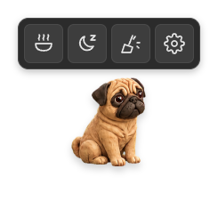
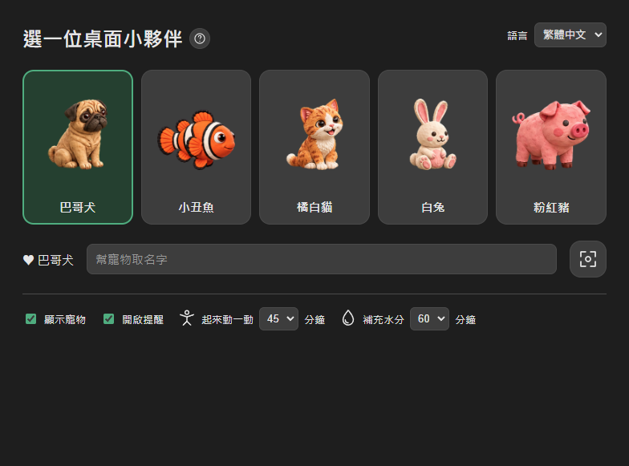

# DesktopPal（桌面小萌寵）

跨平台（Windows / macOS）桌面虛擬寵物陪伴軟體。一隻透明、可穿透滑鼠事件的小寵物在桌面上巡邏、睡覺、跟你互動，並用久坐 / 喝水提醒順便照顧你的健康。

*[English →](README.md)*

## 畫面截圖

| 桌面寵物（工具列展開） | 寵物選擇與設定視窗 |
| --- | --- |
|  |  |

## 功能特色

- **5 種可切換的寵物**：巴哥犬、小丑魚、橘白貓、白兔、粉紅豬（`assets/pets/catalog.json` 定義清單），各自有一整套 idle/walk/run/eat/sleep/drag/react… 等 spritesheet 動畫。
- **飢餓度 / 心情度養成機制**：會隨時間下降，太餓時心情掉更快、行動也變慢；放置食物讓寵物自己走過去吃，摸摸和搓一搓牠都會加心情。
- **便便 / 嘔吐機制**：吃太飽會消化不良吐出來，正常吃飽一段時間後會便便，點擊清理（含掃把動畫）。
- **手勢互動**：按住拖曳搬移位置、滑鼠在牠身上來回搓可觸發搓摸反應、點擊牠就能摸摸、移入顯示工具列。
- **工具列**：餵食、休息 / 叫醒（寵物睡著後按鈕會自動變成「叫醒」）、清理、開啟設定（齒輪按鈕直接開啟寵物選擇視窗，切換寵物也在裡面）。
- **久坐 / 喝水提醒**：預設 45 / 60 分鐘，會偵測系統閒置時間，太久沒動作不會在你離開電腦時跳提醒；提醒卡片貼在寵物旁邊，可標記完成或 5 分鐘後再提醒。
- **寵物選擇視窗**（系統匣點擊開啟，或工具列齒輪按鈕）：切換寵物、把寵物帶到目前螢幕、開關寵物顯示、設定提醒間隔、切換語言。
- **多語言**：跟隨系統 / 繁體中文 / 简体中文 / English，全部文字與圖示標籤都在 `src/renderer/ui.js` 集中管理。
- **系統匣選單 + 寵物身上右鍵選單**：兩者共用同一份「餵食/摸摸/休息/清理/切換寵物」選單邏輯（`src/main/main.ts` 的 `actionMenuItems()`）。

## 技術棧

- **Electron + TypeScript**：跨平台桌面應用框架，對透明視窗、置頂、click-through、系統匣（tray）等桌面寵物核心需求生態成熟。
- **Renderer**：純 HTML/CSS + DOM，寵物動畫以 spritesheet 逐幀切換 `` 呈現（不用 Canvas）。
- **主行程（main process）**：管理寵物視窗（透明無框、`alwaysOnTop`、`setIgnoreMouseEvents` 做 click-through）、寵物選擇視窗、tray 選單、跨視窗共用狀態、IPC。
- **狀態管理**：Node.js 端維護每隻寵物各自獨立的飢餓度/心情/消化計時器（`PetStateManager`），透過 IPC 廣播到所有視窗。

## 專案結構

```
src/
  main/
    main.ts        # 視窗管理、tray、IPC、計時器、選單
    petState.ts    # 飢餓/心情/消化/便便狀態機（每隻寵物各自獨立）
    reminders.ts    # 久坐/喝水提醒的排程與延後邏輯
    trayIcon.ts     # 產生系統匣圖示（色塊佔位，之後可換正式圖示）
  preload/
    preload.ts      # contextBridge 曝露的 window.petAPI
  renderer/
    index.html / renderer.ts / style.css   # 桌面寵物本體視窗
    picker.html / picker.js                # 寵物選擇 + 設定視窗
    ui.js                                  # 兩個視窗共用的 i18n 文字與 SVG 圖示
  shared/
    types.ts        # main/renderer 共用型別
assets/
  pets/<id>/manifest.json + 逐幀 PNG   # 每隻寵物的動畫資料，build 時會複製進 dist/
  pets/catalog.json                    # 可選寵物清單（id/name/motion/speed）
scripts/
  copy-static.js           # build 時把 renderer 靜態檔與 assets 複製進 dist/
  smoke-pets.cjs           # 用 Electron debugger protocol 跑過主要互動流程的端對端煙霧測試
  capture-screenshots.cjs  # 開發用小工具：產生本文件用的截圖
  generate-icon.cjs        # 開發用小工具：用巴哥犬素材合成 build/icon.png（electron-builder 打包會用到）
  blender-client.cjs       # 手動開發用小工具，透過 socket 跟正在執行的 Blender MCP 對話
  build-2d-sprites.cjs     # 一次性腳本：把 Blender 匯出的 pose atlas 去背/裁切成 spritesheet 幀
```

## 開發

```bash
npm install       # 安裝相依套件
npm run build     # tsc 編譯 + 把 renderer 靜態檔與 assets 複製到 dist/
npm run dev       # tsc -w，持續編譯（另開一個終端機跑 npm start 看效果）
npm start         # build 後直接啟動 Electron
```

⚠️ **如果你的 shell 環境變數帶有 `ELECTRON_RUN_AS_NODE=1`**（某些 CI 或沙盒 shell 常見）：`npm start` / `electron .` 會被當成純 Node 執行（`require('electron')` 拿到的是路徑字串而非 API，畫面會直接噴 `Cannot read properties of undefined (reading 'whenReady')`）。手動繞過的方法：

```bash
env -u ELECTRON_RUN_AS_NODE ./node_modules/electron/dist/electron.exe .
```

一般終端機（PowerShell、純 shell、IDE 內建終端）通常不會設定這個變數，直接 `npm start` 就沒問題。

### 煙霧測試

```bash
npm run build
env -u ELECTRON_RUN_AS_NODE ./node_modules/electron/dist/electron.exe scripts/smoke-pets.cjs
```

會自動開啟寵物視窗，依序跑過切換 5 種寵物、餵食、摸摸、睡覺、拖曳、放置食物、清理便便/嘔吐物、搓摸手勢、久坐/喝水提醒、多語言切換等流程，任何一步卡住或行為不對都會丟出 assertion 讓你知道哪裡壞了。

## 打包成安裝檔（跨平台發佈）

使用 [electron-builder](https://www.electron.build/)：

```bash
npm run dist        # 打包目前所在的作業系統
npm run dist:win     # Windows：輸出 NSIS 安裝檔（DesktopPal Setup x.x.x.exe）+ 免安裝版（DesktopPal x.x.x.exe）
npm run dist:mac     # macOS：輸出 .dmg + .zip（必須在 macOS 主機上執行，或用 CI）
npm run dist:linux   # Linux：輸出 AppImage
```

輸出檔案都在 `release/`（已加進 `.gitignore`，不會進版控）。

- 打包設定在 `package.json` 的 `build` 欄位。`files` 只包含 `dist/**/*`，因為 main process 只會從 `dist/assets/...`（build 時由 `scripts/copy-static.js` 複製過去）讀取寵物素材，專案根目錄的 `assets/` 原始檔不會、也不需要被打包進最終產物，所以安裝檔可以維持精簡。
- App icon（`build/icon.png`，1024×1024）是用巴哥犬的圖案合成的，electron-builder 會自動從這張圖產生各平台需要的 `.ico`/`.icns`。要更換圖示：執行 `env -u ELECTRON_RUN_AS_NODE ./node_modules/electron/dist/electron.exe scripts/generate-icon.cjs` 重新產生，或直接用你自己的 1024×1024 正方形 PNG 取代 `build/icon.png`。
- macOS 的 `.dmg` / `.zip` 只能在真正的 macOS 機器上打包（Apple 工具鏈的限制），或串進有 macOS runner 的 CI（例如 GitHub Actions 的 `macos-latest`）。

## 美術資源管線

現在 5 隻寵物的 spritesheet 都已經是最終成品（`assets/pets/<id>/`），**執行或打包這個 App 不需要 Blender**。只有想重新產生或修改造型時才會用到：

1. 用 Blender MCP 建模、擺姿勢，匯出 pose atlas 圖（一張圖裡排好幾個姿勢）。
2. `scripts/build-2d-sprites.cjs` 把 atlas 去背、裁切、加上簡單的呼吸/動作形變，輸出成 `assets/pets/<id>/manifest.json` 裡描述的每一幀 PNG。

當時反覆試驗用的 Blender 專案檔（`.blend`）、渲染過程的中繼圖、以及一次性腳本，因為體積很大（50MB+）且與可執行的 App 無關，並不包含在這個版本庫裡。如果你要接手重新產生或調整造型，需要自行重建一套 Blender 工作環境，或跟前一位維護者要備份——這些都不是建置或執行 DesktopPal 的必要條件。

## 重要限制／陷阱

動手改 `src/renderer/renderer.ts` 前，有兩個限制要注意：

- **絕對不能有任何 top-level `import`/`export`**。它是用純 `<script src="./renderer.js">` 載入（沒開 nodeIntegration），一旦被 tsc 當成 ES module 編譯成 CommonJS，開頭就會多出 `Object.defineProperty(exports, "__esModule", ...)`，瀏覽器端沒有 `exports`，整支腳本會直接拋錯而完全不執行。需要型別時用本地 `interface` 重新宣告，或用 `(window as unknown as {...}).xxx` 斷言，不要 `declare global` 擴充 `Window`（那也需要檔案是 module）。
- **不能宣告一個叫 `petAPI` 的頂層變數**（例如 `const petAPI = window.petAPI`）。`src/preload/preload.ts` 裡的 `contextBridge.exposeInMainWorld("petAPI", ...)` 會把 `window.petAPI` 設成不可設定（non-configurable）的屬性，跟它同名的頂層 `const`/`let` 宣告會被判定成「重複宣告」而丟出 parse-time 的 `SyntaxError`，讓整支 script 完全無法執行。改用 `const api = (window as unknown as {petAPI: PetAPI}).petAPI;` 來避開撞名。

這兩個坑的共同症狀都是「畫面上什麼都不動、點擊也沒反應，且沒有明顯報錯」，因為主行程原本看不到 renderer 的 console。`src/main/main.ts` 的 `createPetWindow()` 裡已經加了 `webContents.on("console-message"/"render-process-gone"/"did-fail-load", ...)` 把 renderer 的錯誤轉印到主行程的終端機，遇到類似「畫面沒反應」的狀況，先看這裡的 log。

## 貢獻

每隻寵物的行為完全由自己的 `manifest.json`（`behaviors`、`rest`、動畫幀清單）驅動，不是寫死在程式碼裡，所以新增第 6 種寵物主要是美術/資料工作，不太需要改邏輯。歡迎發 PR 或開 issue。

## 授權

[MIT](LICENSE)
